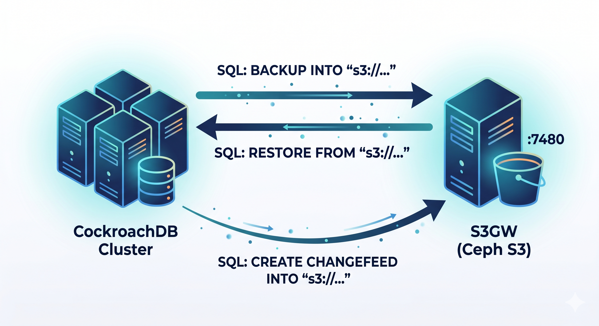

# cr_ceph

Standalone S3-compatible Ceph storage manager for [CockroachDB](https://www.cockroachlabs.com/). Manages the full lifecycle of an [S3GW](https://s3gw-docs.readthedocs.io/) container for backups, CDC changefeeds, and data export/import.

**Zero dependencies on external scripts** — copy the single `cr_ceph` file anywhere and run it.

## Features

- **One-command setup** — pulls S3GW image, creates container, configures user and buckets
- **Backup & Restore** — `BACKUP DATABASE` to S3 and `RESTORE` with a single command
- **CDC integration** — generates changefeed URIs pointing to S3 buckets
- **URI generator** — produces ready-to-use `BACKUP`, `RESTORE`, and `CREATE CHANGEFEED` SQL statements
- **Demo mode** — end-to-end walkthrough: create database, backup, restore, verify
- **Multi-tenant support** — works with CockroachDB virtual clusters (`-t tenant`)
- **Container runtime auto-detection** — works with Docker or Podman
- **Persistent state** — remembers container config across sessions (`~/.cr_ceph/state.conf`)
- **Disk space validation** — warns before exceeding 80% of available space

## Subcommands

| Subcommand | Description |
|------------|-------------|
| `setup` | Create and start S3GW container, create user, create buckets |
| `status` | Show running S3GW container info (port, buckets, endpoints) |
| `create-bucket` | Create a new S3 bucket |
| `list-buckets` | List all S3 buckets |
| `list-backups` | Show databases backed up in an S3 bucket (`SHOW BACKUPS`) |
| `show-backup` | Show details of the latest backup (`SHOW BACKUP FROM LATEST`) |
| `uri` | Generate `BACKUP`/`RESTORE`/`CDC` URIs for CockroachDB |
| `backup` | Backup a database to S3 (requires `-d`) |
| `restore` | Restore a database from S3 (requires `-d`, `--restore-as`) |
| `demo` | Run full demo: create sample DB, backup to S3, restore from S3 |
| `cleanup` | Remove S3GW container and optionally images |

## Prerequisites

| Dependency | Required For | Install (macOS) | Install (Ubuntu/Debian) |
|------------|-------------|-----------------|------------------------|
| **Bash 4.0+** | All | `brew install bash` (macOS ships 3.2) | Pre-installed (5.x+) |
| **Docker** or **Podman** | All subcommands (except `uri`) | `brew install podman` or [Docker Desktop](https://www.docker.com/products/docker-desktop/) | `sudo apt install -y podman` or [Docker Engine](https://docs.docker.com/engine/install/ubuntu/) |
| **curl** | `setup` (readiness check) | Pre-installed | `sudo apt install -y curl` |
| **AWS CLI v2** | `list-buckets`, `create-bucket`, `demo`; optional for `setup` | `brew install awscli` | See below |
| **cockroach CLI** | `backup`, `restore`, `list-backups`, `show-backup`, `demo` | `brew install cockroachdb/tap/cockroach` | See below |

**Ubuntu/Debian: AWS CLI v2 install:**

```bash
curl "https://awscli.amazonaws.com/awscli-exe-linux-x86_64.zip" -o awscliv2.zip \
  && unzip awscliv2.zip && sudo ./aws/install && rm -rf aws awscliv2.zip
```

**Ubuntu/Debian: CockroachDB CLI install:**

```bash
curl https://binaries.cockroachdb.com/cockroach-v25.2.12.linux-amd64.tgz | tar -xz \
  && sudo cp cockroach-v25.2.12.linux-amd64/cockroach /usr/local/bin/
```

**CockroachDB Enterprise License** (optional) — required for `BACKUP`, `RESTORE`, and `CREATE CHANGEFEED` SQL operations:

```bash
export CRDB_ENTERPRISE_LICENSE="crl-0-..."
```

A free trial license can be obtained from the [CockroachDB Licensing page](https://www.cockroachlabs.com/pricing/).

## Quick Start

```bash
# Clone the repository
git clone https://github.com/amaddahian/cr_ceph.git
cd cr_ceph
chmod +x cr_ceph

# 1. Clean up any previous S3GW state
./cr_ceph cleanup

# 2. Setup S3GW container
./cr_ceph setup

# 3. Run the full demo (creates sample DB, backs up, restores, verifies)
./cr_ceph demo --insecure
```

## Usage

### Setup

```bash
# Default setup (S3GW on port 7480, 1G quota, 20G OSD)
cr_ceph setup

# Custom setup
cr_ceph setup --bucket my-backups --cdc-bucket my-cdc --quota 5G --osd-size 50G

# Use a specific container runtime
cr_ceph setup --runtime docker

# Custom S3 credentials
cr_ceph setup --access-key MYKEY --secret-key MYSECRET
```

### Backup & Restore

```bash
# Backup a database
cr_ceph backup -d movr --insecure

# Backup from a specific tenant
cr_ceph backup -d movr -t va --insecure

# Restore a database under a new name
cr_ceph restore -d movr --restore-as movr_new --insecure

# List backed-up databases
cr_ceph list-backups --insecure

# List backups in a specific bucket/tenant
cr_ceph list-backups --bucket crdb-test-backups -t system --insecure

# Show details of the latest backup
cr_ceph show-backup --insecure
```

### URI Generation

```bash
# External endpoint (host access, default)
cr_ceph uri

# Internal endpoint (container-to-container)
cr_ceph uri --internal

# Specific bucket
cr_ceph uri --bucket my-backups --internal
```

### Bucket Management

```bash
# List all buckets
cr_ceph list-buckets

# Create a new bucket
cr_ceph create-bucket --name test-bucket
```

### Cleanup

```bash
# Remove S3GW container
cr_ceph cleanup

# Remove container and images
cr_ceph cleanup --remove-images
```

## Global Options

| Option | Description | Default |
|--------|-------------|---------|
| `--runtime RUNTIME` | Container runtime: `docker` or `podman` | Auto-detected |
| `--container NAME` | S3GW container name | `s3gw-rgw` |
| `--s3-port PORT` | Host S3 port | `7480` |
| `--access-key KEY` | S3 access key | `CRDBACCESS` (or `$S3_ACCESS_KEY`) |
| `--secret-key KEY` | S3 secret key | `CRDBSECRET` (or `$S3_SECRET_KEY`) |
| `-h, --host HOST` | CockroachDB host | `localhost` |
| `-p, --port PORT` | CockroachDB SQL port | `26257` |
| `-U, --user USER` | CockroachDB user | `root` |
| `-d, --database DB` | CockroachDB database | — |
| `-t, --tenant TENANT` | Virtual cluster / tenant | `system` |
| `--insecure` | Insecure CockroachDB connection | — |
| `--certs-dir DIR` | CockroachDB certs directory | — |

## Environment Variables

| Variable | Description |
|----------|-------------|
| `S3_ACCESS_KEY` | S3 access key (overrides default `CRDBACCESS`) |
| `S3_SECRET_KEY` | S3 secret key (overrides default `CRDBSECRET`) |

## How It Works

`cr_ceph` uses [S3GW](https://s3gw-docs.readthedocs.io/) — a lightweight, S3-compatible gateway built on Ceph — running as a container. This provides a local S3-compatible endpoint that CockroachDB can use natively for `BACKUP`, `RESTORE`, and `CREATE CHANGEFEED` operations without requiring cloud storage.



State is persisted to `~/.cr_ceph/state.conf` so credentials, endpoints, and bucket names survive across sessions.

## Part of Roachie

`cr_ceph` is extracted from the [Roachie](https://github.com/amaddahian/roachie) CockroachDB DBA toolkit. It works as a fully standalone tool — no other roachie components are needed.

## License

Licensed under the [Apache License 2.0](LICENSE).
